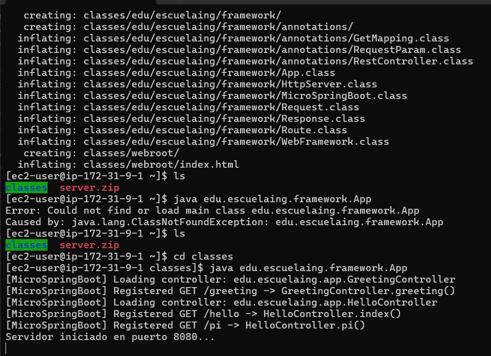
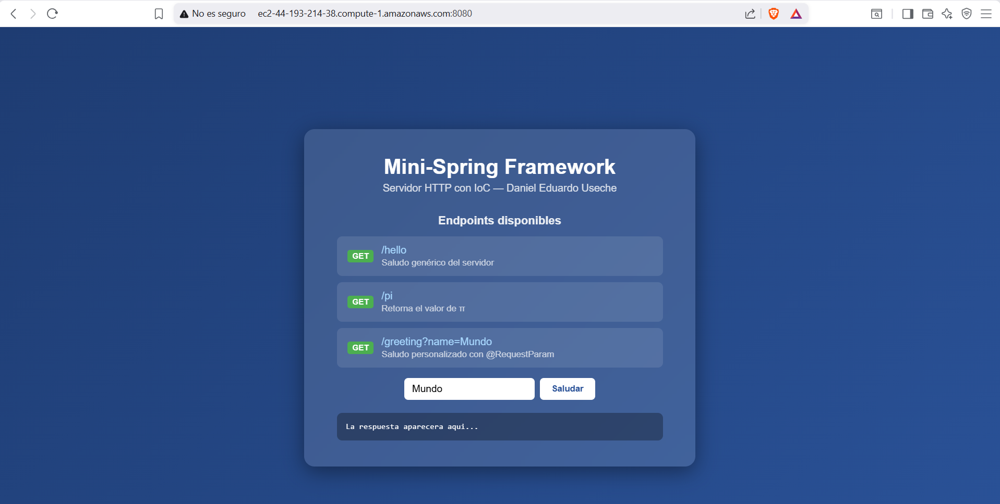
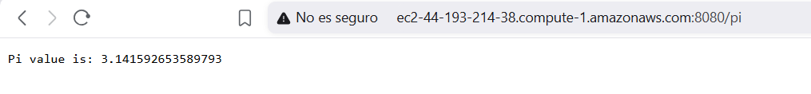

# Mini-Spring Framework

**Autor:** Daniel Eduardo Useche
**Asignatura:** Taller de Desarrollo de Software Empresarial (TDSE)
**Version:** 2.0-SNAPSHOT

---

## Tabla de Contenidos

1. [Descripcion General](#descripcion-general)
2. [Estado Inicial del Proyecto](#estado-inicial-del-proyecto)
3. [Cambios Implementados](#cambios-implementados)
4. [Arquitectura del Framework IoC](#arquitectura-del-framework-ioc)
5. [Estructura del Proyecto](#estructura-del-proyecto)
6. [Componentes del Framework](#componentes-del-framework)
7. [Aplicacion de Ejemplo](#aplicacion-de-ejemplo)
8. [Instrucciones de Ejecucion](#instrucciones-de-ejecucion)
9. [Endpoints Disponibles](#endpoints-disponibles)
10. [Conceptos Aplicados](#conceptos-aplicados)

---

## Descripcion General

Mini-Spring es un servidor HTTP educativo escrito en Java puro, sin dependencias externas en tiempo de ejecucion. El proyecto demuestra como funcionan internamente los frameworks web modernos como Spring Boot, implementando desde cero un servidor TCP, un sistema de enrutamiento y un contenedor IoC (Inversion of Control) basado en anotaciones y reflexion de Java.

El objetivo principal es construir un prototipo minimo que:

- Atienda solicitudes HTTP (paginas HTML e imagenes PNG).
- Provea un framework IoC para la construccion de aplicaciones web a partir de POJOs anotados.
- Descubra automaticamente los componentes web usando reflexion de Java sobre el classpath.
- Soporte las anotaciones `@RestController`, `@GetMapping` y `@RequestParam`.

---

## Estado Inicial del Proyecto

Antes de las modificaciones documentadas en este informe, el proyecto contaba con:

### Clases existentes

| Clase | Rol |
|---|---|
| `App.java` | Punto de entrada; registraba rutas manualmente usando lambdas |
| `HttpServer.java` | Servidor TCP en el puerto 8080 |
| `WebFramework.java` | Registro de rutas en un `Map<String, Route>` |
| `Request.java` | Parseo de query parameters |
| `Response.java` | Clase vacia, reservada para uso futuro |
| `Route.java` | Interfaz funcional `handle(Request, Response): String` |

### Limitaciones identificadas

1. Las rutas se registraban programaticamente en `App.java` mediante lambdas, lo que rompe el principio de separacion de responsabilidades.
2. El servidor no utilizaba anotaciones ni reflexion; el framework no tenia capacidad IoC.
3. La carga de archivos estaticos usaba una ruta relativa al sistema de archivos (`"../main/resources/..."`) que no funcionaba correctamente al ejecutar desde el directorio `target/classes` de Maven.
4. No existia mecanismo para que el framework descubriera componentes automaticamente.

---

## Cambios Implementados

### 1. Paquete de Anotaciones (`edu.escuelaing.framework.annotations`)

Se crearon tres anotaciones Java con retencion en tiempo de ejecucion (`RUNTIME`), que permiten al framework identificar componentes y metadatos mediante reflexion:

**`@RestController`**
Anotacion de tipo (`ElementType.TYPE`). Marca una clase POJO como controlador web. El scanner de IoC busca esta anotacion en todas las clases del classpath para registrarlas automaticamente.

**`@GetMapping`**
Anotacion de metodo (`ElementType.METHOD`). Recibe como parametro el valor de la ruta URI a la que responde el metodo. Solo se procesan metodos con tipo de retorno `String`.

**`@RequestParam`**
Anotacion de parametro (`ElementType.PARAMETER`). Especifica el nombre del query parameter HTTP que se debe inyectar como argumento del metodo, e incluye un atributo `defaultValue` para cuando el parametro no es enviado por el cliente.

---

### 2. Clase `MicroSpringBoot` (Scanner IoC)

Se creo la clase `MicroSpringBoot` con un metodo estatico `run()` que implementa el descubrimiento automatico de componentes mediante la API de reflexion de Java (`java.lang.reflect`).

**Proceso de escaneo:**

1. Se lee la propiedad del sistema `java.class.path` para obtener todas las entradas del classpath.
2. Por cada entrada que sea un directorio, se recorre recursivamente el sistema de archivos buscando archivos `.class`.
3. Cada archivo `.class` se convierte en nombre de clase calificado y se carga con `Class.forName(className)`.
4. Si la clase tiene la anotacion `@RestController`, se instancia con `getDeclaredConstructor().newInstance()`.
5. Se iteran los metodos de la clase buscando `@GetMapping`. Por cada metodo encontrado:
   - Se extrae la ruta del atributo `value()` de la anotacion.
   - Se registra una `Route` (lambda) en `WebFramework` que, al ser invocada, usa reflexion para construir los argumentos del metodo inspeccionando las anotaciones `@RequestParam` de cada parametro.
   - Si el query parameter esta presente en la solicitud, se usa su valor; en caso contrario se usa el `defaultValue`.
   - El metodo se invoca con `Method.invoke(instance, args)` y el resultado (`String`) se retorna como cuerpo de la respuesta HTTP.

Este mecanismo es funcionalmente equivalente al que usa Spring Framework internamente, aunque considerablemente mas simple.

---

### 3. Controladores de Ejemplo (`edu.escuelaing.app`)

Se creo el paquete `edu.escuelaing.app` para albergar los componentes web de la aplicacion de ejemplo, separandolos del nucleo del framework.

**`HelloController`**
Controlador con dos endpoints que retornan cadenas de texto simples. Demuestra el uso basico de `@RestController` y `@GetMapping` sin parametros.

**`GreetingController`**
Controlador que demuestra el uso de `@RequestParam`. El metodo `greeting` recibe el parametro `name` del query string con valor por defecto `"World"` y retorna un saludo personalizado junto con un contador atomico de visitas (`AtomicLong`), demostrando que la instancia del controlador persiste entre solicitudes (comportamiento singleton).

Con la implementacion IoC, estos controladores son descubiertos y registrados automaticamente al iniciar el servidor, sin necesidad de modificar `App.java`.

---

### 4. Actualizacion de `HttpServer.java`

**Problema resuelto:** La version anterior usaba una ruta relativa al sistema de archivos para localizar archivos estaticos:

```java
String fullPath = "../main/resources" + WebFramework.getStaticFolder() + path;
File file = new File(fullPath);
```

Este enfoque depende del directorio de trabajo actual al momento de lanzar el proceso y falla cuando se ejecuta desde `target/classes` o desde un JAR.

**Solucion implementada:** Se reemplazo la carga por sistema de archivos con la API de `ClassLoader`:

```java
InputStream fileStream = HttpServer.class.getClassLoader()
    .getResourceAsStream(classpathResource);
```

Esto garantiza que los recursos estaticos se buscan dentro del classpath (incluyendo el interior de un JAR ejecutable), haciendolo robusto independientemente del directorio de trabajo.

Adicionalmente se corrigio el manejo de conexiones: se eliminaba el `PrintWriter` antes de que las demas operaciones pudieran completarse, causando cierres prematuros del socket; el flujo de cierre se reordeno correctamente.

---

### 5. Actualizacion de `App.java`

El punto de entrada se simplifica radicalmente. Ya no registra rutas manualmente; su unica responsabilidad es:

1. Configurar la carpeta de archivos estaticos.
2. Invocar `MicroSpringBoot.run()` para que el framework descubra y registre todos los controladores.
3. Iniciar el servidor HTTP.

Antes:
```java
WebFramework.staticfiles("/webroot");
WebFramework.get("/App/hello", (req, resp) -> "Hello " + req.getValues("name"));
WebFramework.get("/App/pi",    (req, resp) -> String.valueOf(Math.PI));
HttpServer.main(args);
```

Despues:
```java
WebFramework.staticfiles("webroot");
MicroSpringBoot.run();
HttpServer.main(args);
```

---

### 6. Actualizacion de `index.html`

Se rediseno la pagina principal para reflejar la nueva funcionalidad del framework:

- Se agregaron enlaces a los tres endpoints registrados automaticamente por el IoC.
- Se implemento un formulario interactivo con JavaScript que llama al endpoint `/greeting` usando `fetch()` y muestra la respuesta sin recargar la pagina.
- Se elimino el contenido de prueba anterior.

---

### 7. Actualizacion de `pom.xml`

Se realizaron tres cambios en el archivo de construccion de Maven:

**Flag `-parameters` en el compilador:**
Permite que los nombres de los parametros de los metodos sean accesibles en tiempo de ejecucion mediante la API de reflexion. Aunque en esta implementacion los nombres se obtienen de la anotacion `@RequestParam(value="...")`, el flag es necesario para una futura resolucion de parametros por nombre.

**Plugin `exec-maven-plugin`:**
Permite ejecutar la aplicacion directamente con `mvn exec:java` sin necesidad de construir el JAR.

**Plugin `maven-shade-plugin`:**
Genera un JAR ejecutable (fat jar) que incluye todas las dependencias y define la clase principal en el Manifest. Permite ejecutar la aplicacion con `java -jar target/mini-spring-1.0-SNAPSHOT.jar`.

---

## Arquitectura del Framework IoC

### Flujo de Arranque

```
App.main()
    |
    +-- WebFramework.staticfiles("webroot")
    |       Configura la carpeta de recursos estaticos
    |
    +-- MicroSpringBoot.run()
    |       Lee java.class.path
    |       Recorre directorios buscando archivos .class
    |       Para cada clase con @RestController:
    |           Instancia el POJO (new instance via reflection)
    |           Para cada metodo con @GetMapping:
    |               Lee la ruta del atributo value()
    |               Crea una Route (lambda) que usa reflection
    |               para construir args desde @RequestParam
    |               Registra la Route en WebFramework
    |
    +-- HttpServer.main()
            ServerSocket en puerto 8080
            Loop: acepta Socket -> parsea HTTP -> enruta -> responde
```

### Flujo de una Solicitud HTTP

```
Cliente envia: GET /greeting?name=Ana HTTP/1.1

HttpServer
    Lee la linea de solicitud
    Separa path (/greeting) y query string (name=Ana)
    Consulta WebFramework.getRoute("/greeting")
        -> Encuentra la Route registrada por MicroSpringBoot
    Crea Request("name=Ana") y Response()
    Invoca route.handle(req, res)
        -> La lambda llama GreetingController.greeting("Ana") via reflection
        -> Retorna "Hello, Ana! (visita #1)"
    Envia HTTP/1.1 200 OK con el cuerpo de texto
    Cierra el socket

Cliente recibe: Hello, Ana! (visita #1)
```

### Flujo de un Archivo Estatico

```
Cliente envia: GET / HTTP/1.1

HttpServer
    Path "/" se normaliza a "/index.html"
    No hay Route registrada para "/"
    Construye ruta de classpath: "webroot/index.html"
    ClassLoader.getResourceAsStream("webroot/index.html")
    Lee todos los bytes del stream
    Detecta Content-Type: "text/html; charset=UTF-8"
    Envia HTTP/1.1 200 OK con el contenido del archivo
```

---

## Estructura del Proyecto

```
Mini-Spring/v2/
|
+-- pom.xml
+-- README.md
|
+-- src/
|   +-- main/
|       +-- java/
|       |   +-- edu/escuelaing/
|       |       +-- framework/
|       |       |   +-- annotations/
|       |       |   |   +-- RestController.java
|       |       |   |   +-- GetMapping.java
|       |       |   |   +-- RequestParam.java
|       |       |   |
|       |       |   +-- MicroSpringBoot.java
|       |       |   +-- HttpServer.java
|       |       |   +-- WebFramework.java
|       |       |   +-- Request.java
|       |       |   +-- Response.java
|       |       |   +-- Route.java
|       |       |   +-- App.java
|       |       |
|       |       +-- app/
|       |           +-- HelloController.java
|       |           +-- GreetingController.java
|       |
|       +-- resources/
|           +-- webroot/
|               +-- index.html
|
+-- target/
    +-- classes/          (salida del compilador)
    +-- mini-spring-1.0-SNAPSHOT.jar  (fat jar ejecutable)
```

---

## Componentes del Framework

### `Route.java`

Interfaz funcional sin cambios. Define el contrato de un manejador de solicitud:

```java
@FunctionalInterface
public interface Route {
    String handle(Request req, Response res);
}
```

Su naturaleza funcional permite que tanto las lambdas definidas manualmente como las rutas creadas por reflexion en `MicroSpringBoot` sean intercambiables.

### `WebFramework.java`

Registro central de rutas. Mantiene un `Map<String, Route>` que asocia rutas URI con sus manejadores. No sufrio cambios funcionales; se corrigio unicamente el valor pasado por `App.java` al metodo `staticfiles` (sin barra inicial) para que coincida con la convencion de `ClassLoader.getResourceAsStream`.

### `Request.java`

Parsea la query string de una solicitud HTTP en un `Map<String, String>`. No sufrio cambios.

### `Response.java`

Clase vacia reservada para extensiones futuras (control de status code, headers de respuesta personalizados, etc.). No sufrio cambios.

### `HttpServer.java`

Servidor TCP. Cambios:

- Carga de archivos estaticos migrada de `File` a `ClassLoader.getResourceAsStream`.
- Respuestas de texto incluyen `charset=UTF-8` en el header `Content-Type`.
- Respuesta 404 incluye cuerpo descriptivo y headers correctos (`Content-Length`).
- Correccion en el orden de cierre de streams y socket.

### `MicroSpringBoot.java`

Clase nueva. Implementa el escaneo del classpath y el registro automatico de controladores. Utiliza exclusivamente la API estandar de Java (`java.lang.reflect`, `java.io.File`).

### `App.java`

Punto de entrada simplificado. Delega el registro de rutas al framework IoC.

---

## Aplicacion de Ejemplo

### `HelloController`

```java
@RestController
public class HelloController {

    @GetMapping("/hello")
    public String index() {
        return "Greetings from Mini-Spring!";
    }

    @GetMapping("/pi")
    public String pi() {
        return "Pi value is: " + Math.PI;
    }
}
```

### `GreetingController`

```java
@RestController
public class GreetingController {

    private static final String template = "Hello, %s!";
    private final AtomicLong counter = new AtomicLong();

    @GetMapping("/greeting")
    public String greeting(@RequestParam(value = "name", defaultValue = "World") String name) {
        return String.format(template, name) + " (visita #" + counter.incrementAndGet() + ")";
    }
}
```

El campo `counter` demuestra que la instancia del controlador es creada una sola vez durante el arranque del framework y reutilizada en cada solicitud, comportamiento analogo al scope singleton de Spring.

---

## Instrucciones de Ejecucion

### Prerequisitos

- Java Development Kit (JDK) 11 o superior
- Apache Maven 3.6 o superior

### Compilar

```bash
mvn clean compile
```

### Ejecutar con Maven

```bash
mvn exec:java
```

### Ejecutar como JAR ejecutable

```bash
mvn package
java -jar target/mini-spring-1.0-SNAPSHOT.jar
```

### Ejecutar desde classpath

```bash
java -cp target/classes edu.escuelaing.framework.App
```

### Salida esperada al iniciar

```
[MicroSpringBoot] Loading controller: edu.escuelaing.app.GreetingController
[MicroSpringBoot] Registered GET /greeting -> GreetingController.greeting()
[MicroSpringBoot] Loading controller: edu.escuelaing.app.HelloController
[MicroSpringBoot] Registered GET /hello -> HelloController.index()
[MicroSpringBoot] Registered GET /pi -> HelloController.pi()
Servidor iniciado en puerto 8080...
```

---

## Endpoints Disponibles

| Ruta | Descripcion | Ejemplo |
|---|---|---|
| `GET /` | Pagina HTML principal | `http://localhost:8080/` |
| `GET /hello` | Saludo estatico | `http://localhost:8080/hello` |
| `GET /pi` | Valor de la constante pi | `http://localhost:8080/pi` |
| `GET /greeting` | Saludo personalizado con `@RequestParam` | `http://localhost:8080/greeting?name=Ana` |

Prueba con curl:

```bash
curl http://localhost:8080/hello
curl http://localhost:8080/pi
curl "http://localhost:8080/greeting?name=Daniel"
curl "http://localhost:8080/greeting"
```

---

## Conceptos Aplicados

### Reflexion de Java

El nucleo del framework IoC usa las siguientes APIs:

- `Class.forName(String)` — carga dinamica de clases por nombre.
- `Class.isAnnotationPresent(Class)` — deteccion de anotaciones en tiempo de ejecucion.
- `Class.getDeclaredConstructor().newInstance()` — instanciacion de POJOs sin acoplamiento.
- `Class.getDeclaredMethods()` — inspeccion de los metodos de una clase.
- `Method.getParameters()` — acceso a la lista de parametros de un metodo.
- `Parameter.isAnnotationPresent(Class)` — deteccion de anotaciones en parametros.
- `Method.invoke(Object, Object...)` — invocacion dinamica de metodos en tiempo de ejecucion.

### Principios de Diseno

- **Inversion of Control (IoC):** los controladores no se registran explicitamente; el framework los descubre y los gestiona.
- **Convention over Configuration:** la presencia de `@RestController` es suficiente para que un POJO sea tratado como componente web.
- **Separacion de responsabilidades:** el nucleo del framework (`framework/`) esta desacoplado de la aplicacion de ejemplo (`app/`).
- **Interfaz funcional y lambdas:** `Route` es una interfaz funcional que permite que las rutas generadas por reflexion sean compatibles con las rutas definidas manualmente, sin herencia ni adaptadores.

### Protocolo HTTP

El servidor implementa manualmente el protocolo HTTP/1.1 a nivel de texto:

- Linea de estado: `HTTP/1.1 200 OK`
- Headers: `Content-Type`, `Content-Length`
- Separacion de headers y cuerpo: `\r\n\r\n`
- Deteccion de MIME types por extension de archivo
- Respuestas 404 con cuerpo descriptivo

---

## Limitaciones Conocidas

- El servidor atiende solicitudes de forma secuencial (no concurrente). Una solicitud debe completarse antes de aceptar la siguiente.
- Solo se soporta el metodo HTTP GET.
- Los tipos de retorno de los metodos mapeados deben ser `String`.
- No hay manejo de cookies, sesiones ni autenticacion.
- El escaneo del classpath no procesa archivos JAR de dependencias, solo directorios; esto es suficiente para el caso de uso educativo con `java -cp target/classes`.

---
## Despliegue en AWS

las siguientes imagenes evidencian claramente el despliegue en aws...

1)

2) raiz al index.html 

3) Saludo

4)  PI

5)  Saludo con Nombre


así podemos comprobar el controller Greeting, Hello con las anotaciones.
---

## Licencia

Proyecto academico desarrollado con fines educativos para la asignatura TDSE.
Escuela de Ingenieria de Sistemas — Daniel Eduardo Useche, 2026.
